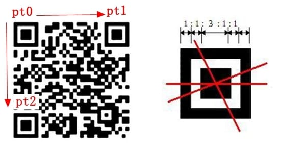
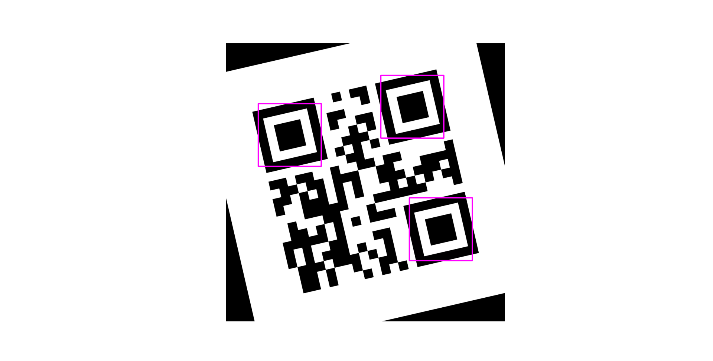
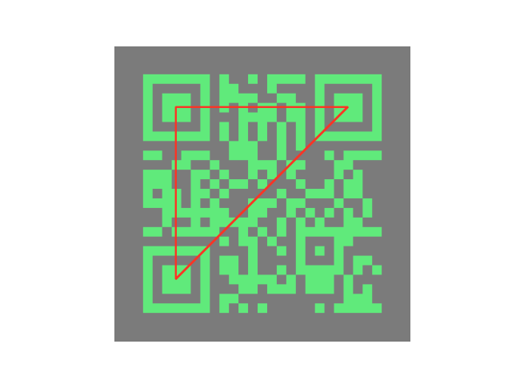

# QR Code Recognition using OpenCV-Python
## Introduction
&nbsp;&nbsp;This project aims to develop a QR code recognition system using OpenCV-Python. Unlike traditional machine learning approaches, this system identifies QR codes in images solely based on the position patterns inherent to QR codes, without the need for machine learning models.

## Rationale
&nbsp;&nbsp;QR codes are widely used for encoding information such as URLs, product details, or authentication tokens. Recognizing QR codes from images is a common requirement in various applications ranging from mobile payment systems to inventory management. This project is tested based on the principle of QR code. The specific process will be introduced in the next section.

## Core Idea
&nbsp;&nbsp;The core idea of this project is to identify QR codes by locating their three positioning angles. QR codes contain three distinctive square patterns called positioning squares or finder patterns, which are used to locate and orient the code within an image. By detecting these positioning angles, we can accurately locate and extract the QR code from the image.

### 1. How QR codes work
&nbsp;&nbsp;For a properly placed normal QR code, its three positioning blocks are located in the upper left corner, lower left corner and upper right corner respectively. As shown below:
  
Each positioning block consists of three parts, namely the outermost black square, the middle white square and the inner black square. According to this feature, we can locate the QR code in the picture. In addition, these three parts have the geometric relationship as shown in the figure, which is a further condition for us to judge whether an area is a QR code.  
&nbsp;&nbsp;It should be noted that there are many beautified QR codes now, and their positioning angle may be a prototype, or just a point. These special QR codes are outside the scope of this project

### 2. How the project works
&nbsp;&nbsp;For a picture, the following operations will be performed:
#### 2.1 Image preprocessing
&nbsp;&nbsp;First, using opencv-python to read an image, then convert the image to grayscale, binarize the image, morphological operations and do the edge detection.
#### 2.2 Contours detection
&nbsp;&nbsp;Using opencv APIs to get all contours, and then use the hierarchy relationship to find all possible location areas. Next, based on the geometric relationship of three squares, we can get the three positioning blocks. What I use here is the area relationship between them. Because using opencv can easily find the minimum area enclosing rectangle of each contour. The result after searching is as shown in the figure:

#### 2.3 Final positioning
&nbsp;&nbsp;After locating the three anchor points, find their centers and connect them. When a picture contains multiple QR codes, these center points also need to be sorted.The result after searching is as shown in the figure:

### 3. Usage
1. Use `QRCodeGenerator` class to generate some test images;
2. Use `QRCodeDetector` class to mark QR codes in an image;
3. I have provided some pictures for testing in the images folder (some pictures come from the Internet);
4. Before running the project, run this in your kernel: `pip install -r requirements.txt`;
5. run main.py.

### Future Improvements
1. When the picture is blurry or the QR code is irregular in shape, the recognition effect is poor;
2. Since this project aims to study the working principle of QR code, the entire QR code area was not framed in the end, but only the er on the picture.